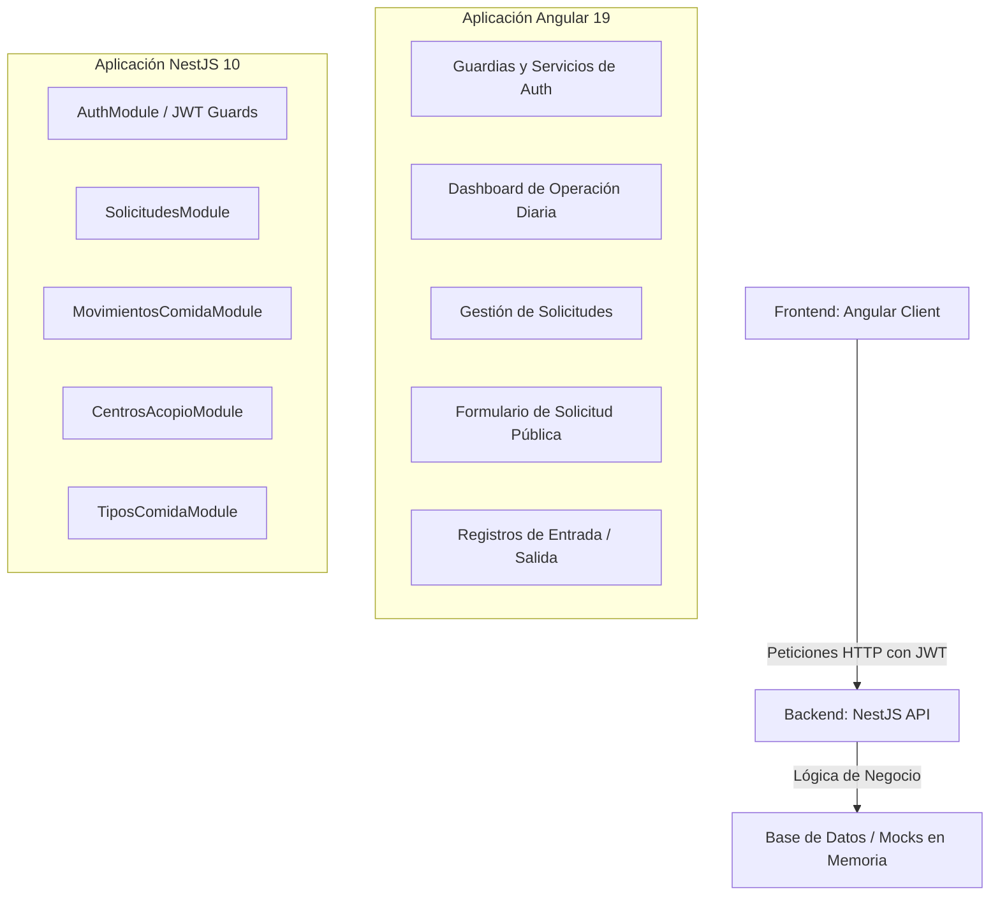
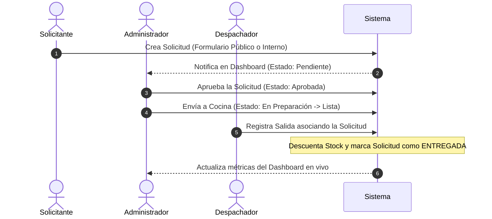

# Funcionamiento de la Aplicación (RestApp / AcopioRed)

Este documento detalla la lógica de negocio, arquitectura y flujo operativo del sistema **AcopioRed / RestApp**, una plataforma diseñada para digitalizar, estructurar y controlar el ciclo completo de gestión de comidas: desde la recepción de la solicitud hasta el despacho y control de inventarios en centros de acopio.

---

## 1. Arquitectura General del Sistema

La aplicación está construida en una arquitectura desacoplada de Frontend y Backend, orientada a la agilidad operativa y la visualización de datos en tiempo real:

---

## 2. Entidades Principales de Datos

El funcionamiento lógico del sistema gira en torno a cinco entidades clave:

1.  **Centros de Acopio (`ICentroAcopio`)**: Puntos de distribución final (comedores, sedes comunitarias, etc.) donde se entregan las raciones. Cada centro cuenta con un nombre, ubicación geográfica y un operador responsable asignado.
2.  **Tipos de Comida (`ITipoComida`)**: El catálogo de variedades disponibles para preparar y despachar (ej. pollo, carne, vegetariano, etc.).
3.  **Solicitudes de Comida (`ISolicitudComida`)**: Pedidos o requerimientos iniciados por los centros de acopio o mediante un formulario público. Poseen un estado operativo dinámico (`PENDIENTE`, `APROBADA`, `EN_PREPARACION`, `LISTA`, `ENTREGADA`, `RECHAZADA`) y prioridades (`ALTA`, `MEDIA`, `BAJA`).
4.  **Movimientos de Comida (`IMovimientoComida`)**: Transacciones que modifican el inventario físico:
    *   **ENTRADA**: Abastecimiento al inventario general (ya sea por producción interna en cocina o donaciones externas).
    *   **SALIDA**: Envío o consumo físico de raciones, asociadas opcionalmente a una solicitud.
5.  **Usuarios / Operadores**: Cuentas con roles específicos que realizan las operaciones en el sistema mediante autenticación segura.

---

## 3. Flujo Operativo y de Navegación (Paso a Paso)

El sistema acompaña al equipo de operaciones en su flujo de trabajo real diario para reducir la carga administrativa:

### 3.1. Acceso y Seguridad (Login)
*   **Propósito**: Garantizar la confidencialidad de la logística y el stock.
*   **Funcionamiento**: Inicio de sesión mediante usuario y contraseña. Utiliza JSON Web Tokens (JWT) para autorizar todas las peticiones hacia el backend. Si el token expira o no existe, el sistema restringe el acceso al resto de pantallas.

### 3.2. Centro de Mando (Dashboard de Operación Diaria)
Es la pantalla de visualización principal en tiempo real. Está diseñada para responder las preguntas clave del día en 5 segundos:
1.  **KPIs Superiores (Tarjetas de Métricas)**:
    *   **Pedidos Pendientes**: Cantidad de solicitudes a la espera de aprobación.
    *   **Pedidos Programados Hoy**: Solicitudes aprobadas, en preparación o listas para ser retiradas en la jornada.
    *   **Salidas Hoy**: Número de raciones despachadas exitosamente.
    *   **Total Inventario**: Raciones disponibles actualmente en stock, junto al porcentaje de avance con respecto a la meta mensual del sistema.
2.  **Gráfico de Flujo de Inventario**: Histograma que compara entradas y salidas consolidadas. Cuenta con filtros interactivos de tiempo: **Semanal**, **Mensual** y **Anual**.
3.  **Estado de Suministros y Disponibilidad**: Gráfico de pastillas coloreadas que muestra la cantidad de stock restante segmentado por variedad de comida, alertando en rojo o amarillo si los insumos están críticamente bajos.
4.  **Solicitudes Programadas y Recientes**: Panel central que enlista las órdenes activas del día y su fase actual de preparación.

### 3.3. Gestión de Solicitudes (Modulo Operativo)
*   Permite a los operadores registrar pedidos de forma interna con datos como el centro destino, variedad de comida, cantidad, hora esperada de entrega, prioridad y observaciones.
*   **Flujo de Estados**: Los operadores de cocina pueden actualizar el estado de los pedidos en tiempo real (de *Aprobada* a *En Preparación*, y luego a *Lista*), informando visualmente en qué fase va la producción del almuerzo.

### 3.4. Formulario de Solicitud Pública
*   **Propósito**: Reducir el desorden de solicitudes por canales como WhatsApp o llamadas.
*   **Funcionamiento**: Una vista pública de acceso libre sin necesidad de login. Permite a los comedores locales o agentes externos registrar un requerimiento de raciones que cae directamente en el buzón de solicitudes pendientes del Dashboard del administrador para su posterior revisión.

### 3.5. Registro de Entradas (Abastecimiento)
*   Formulario simple para notificar al sistema el ingreso de comida.
*   Al registrar una entrada (indicando cantidad, tipo de comida, procedencia y observaciones), el stock acumulativo de esa variedad de comida se incrementa de forma automática en tiempo real.

### 3.6. Registro de Salidas (Despacho de Raciones)
*   Formulario crítico para registrar la partida física de comida a un centro de acopio.
*   **Control de Stock**: El backend realiza una validación lógica inmediata; si el operador intenta despachar una cantidad mayor a la disponible en el inventario para ese tipo de comida, el sistema bloquea la transacción y arroja una alerta de stock insuficiente para evitar descuadres en los registros.
*   **Vinculación Operativa**: Si la salida está asociada a una solicitud previa, registrar la salida automáticamente cambia el estado de esa solicitud a `ENTREGADA` y descuenta las raciones de las métricas.

### 3.7. Historial y Analítica (Reloj/Movimientos)
*   Funciona como el libro contable digital del almacén.
*   Lista todos los movimientos históricos indicando fecha, tipo de movimiento (Entrada/Salida), origen/destino, raciones movilizadas y el operador responsable de registrar el evento. Incluye filtros avanzados por rango de fechas, centros y tipos de alimento.

### 3.8. Reportes e Informes
*   Módulo ejecutivo que consolida el flujo total de raciones distribuidas por periodos de tiempo, facilitando la exportación de reportes y auditorías de la gestión.

---

## 4. Lógica del Backend (NestJS)

*   **Modularidad**: Cada dominio de la aplicación (`auth`, `solicitudes`, `movimientos-comida`, `centros-acopio`, `tipos-comida`) es un módulo encapsulado e independiente que interactúa a través de servicios inyectables (`@Injectable()`).
*   **Validación de Datos**: Las entradas de datos a la API son analizadas por tuberías globales (`ValidationPipe`) que rechazan cualquier petición que no coincida estrictamente con los esquemas de transferencia de datos (DTOs).
*   **Manejo de Stock**: El stock actual de cada variedad de comida no está guardado de forma rígida, sino que se calcula dinámicamente sumando todas las entradas y restando todas las salidas en el servicio `MovimientosComidaService`, asegurando que la información sea 100% verídica en base al historial de transacciones.
